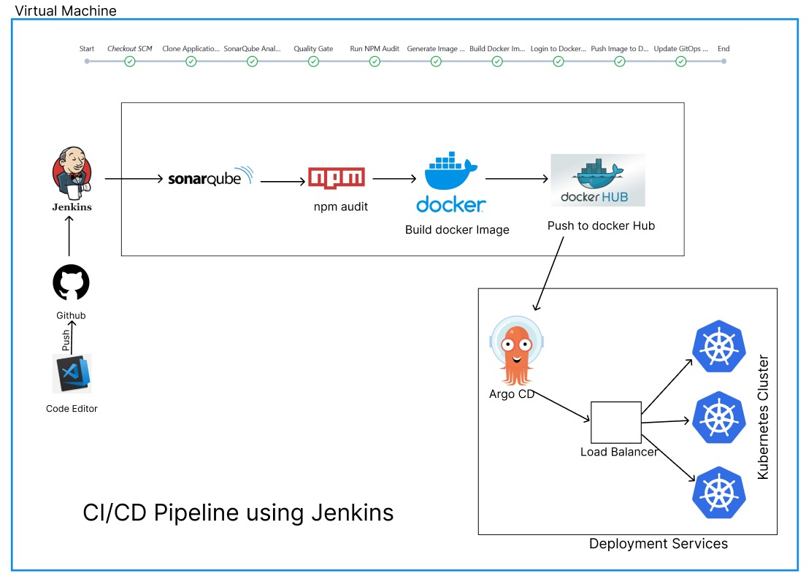
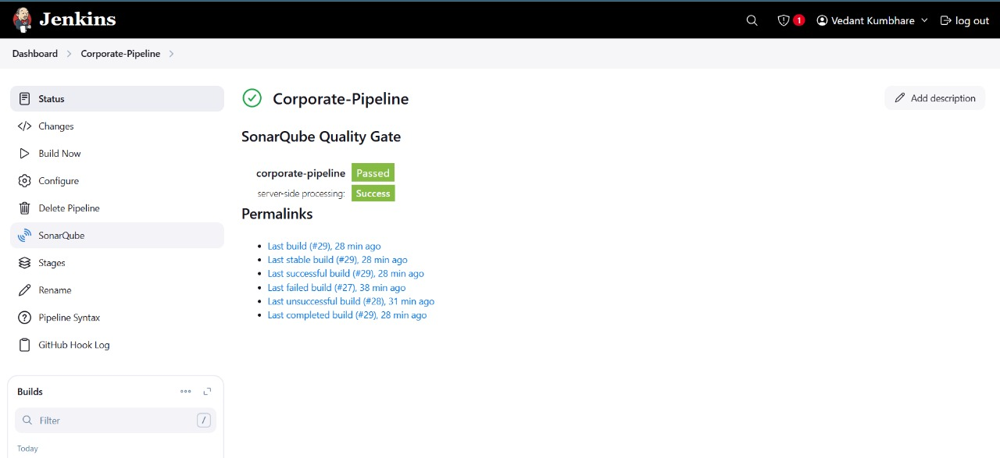
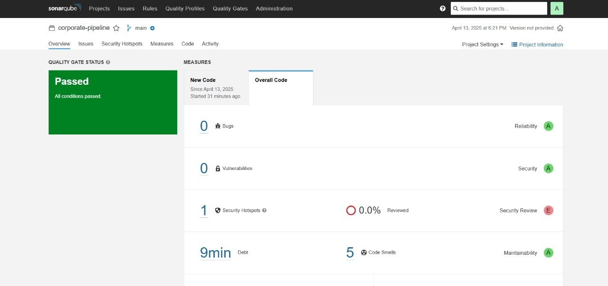
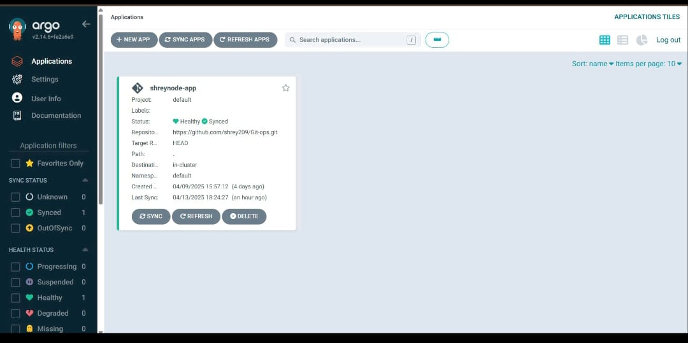

# 🚀 CI/CD Pipeline with Jenkins, Docker, Argo CD, and Kubernetes on AWS

This project demonstrates a complete **CI/CD pipeline** setup using **Jenkins**, **Docker**, **SonarQube**, **Argo CD**, and **Kubernetes**, all running on an **AWS EC2 instance**.

The pipeline automates the process of building, testing, and deploying a Node.js application (or similar) into a Kubernetes cluster using GitOps principles.

---
## 🧱 Architecture Overview






> 

---

## ⚙️ Tools & Technologies Used

- **Jenkins** – For Continuous Integration (CI)  
- **Docker** – For containerization  
- **SonarQube** – For static code analysis   
- **npm audit** – For security vulnerability checks  
- **Docker Hub** – For storing built images  
- **Argo CD** – For GitOps-based deployment  
- **Kubernetes** – For orchestrating deployments  
- **GitHub** – Source control and triggering builds via webhook  
- **AWS EC2** – Virtual machine for Jenkins and Docker  

---

## 🧭 CI/CD Workflow

1. **Code Push**  
   Developers push code changes to GitHub.

2. **Trigger Jenkins Pipeline**  
   - A webhook triggers Jenkins on every code commit.  
   - Jenkins checks out the code from GitHub.

3. **Code Analysis**  
   - Runs a **SonarQube** scan for code quality checks.  
   - Executes `npm audit` to detect security vulnerabilities.

4. **Build & Push Docker Image**  
   - Builds a Docker image of the application.  
   - Pushes the image to **Docker Hub**.

5. **GitOps Update**  
   - Updates the GitOps repository (e.g., Kubernetes manifests with new image tag).

6. **Argo CD Sync**  
   - Argo CD detects the manifest change and redeploys the updated image to the Kubernetes cluster.

7. **Kubernetes Deployment**  
   - Kubernetes handles rolling updates through Deployments.  
   - A LoadBalancer distributes traffic to the pods.

---

## 📂 Project Directory Structure

```bash
.
├── Jenkinsfile
├── Dockerfile
├── k8s-manifests/
│   └── deployment.yaml
│   └── service.yaml
├── src/
│   └── ...
└── README.md
